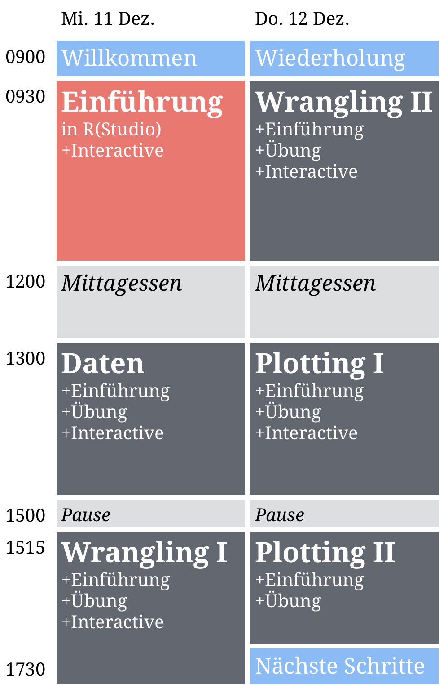

layout: true

<div class="my-footer">
  <span style="text-align:center">
    <span> 
      
    </span>
    <a href="https://therbootcamp.github.io/">
      <span style="padding-left:82px"> 
        <font color="#7E7E7E">
          www.therbootcamp.com
        </font>
      </span>
    </a>
    <a href="https://therbootcamp.github.io/">
      <font color="#7E7E7E">
       Explorative Datenanalyse mit R @ CSS | Dezember 2019
      </font>
    </a>
    </span>
  </div> 

---


```{r setup, include=FALSE}
options(htmltools.dir.version = FALSE)
options(width=110)
options(digits = 4)

knitr::opts_chunk$set(fig.align = 'center')
```


.pull-left45[
<br><br><br><br><br>
#  Schedule and Materials

Click the "Bootcamp running" link on our homepage!

<font size="6" color="#F62D73"><a href="www.therbootcamp.com"><b>www.therbootcamp.com</b></a></font><br><br>

]

.pull-right5[

<br><br>
<iframe src="https://therbootcamp.github.io" width="500" height="500"></iframe>

]


---


.pull-left6[

<br><br><br>

# Ziel


>###Das Ziel dieses Kurses ist Euch die Grundlagen der Programmiersprache R und den kompetenten Einsatz von R für die Aufbereitung, Exploration, und Visualisierung von Daten zu vermitteln. 

]

.pull-right4[

<br><br><br><br>
<p align="center"></p>

]


---

.pull-left3[

# Der Data Science Kreislauf

]

.pull-right7[
<br>
<p align = "center">
<br>
<font style="font-size:10px">from <a href="http://sudeep.co/">http://sudeep.co/</a></font>
</p>
]

---

.pull-left4[

<br>
# Agenda 

Der Workshop beinhaltet eine Einführung in R und 5 <high>2-2.5h Blöcke</high> zu explorativen Datenanalyse. 

Jeder Block beginnt mit einer folien-basierten <high>Einführung (30-45min)</high> und schliesst mit einer interaktiven <high>Übung (1.5-2h)</high> ab. 


]

.pull-right45[
<br><br>


]

---


# Einführung

.pull-left45[
<br2>
<high>30 - 45 min folien-basierte Einführung</high> um Euch die zentralen Konzepte zu vermitteln.

<high>Alle Materialien sind online verfügbar</high>. Später teilen wir mit Euch noch PDFs.

<a href="https://therbootcamp.github.io/EDA_2019CSS/">Dies ist ein Link zu Euren Materialien</a>.

]

.pull-right55[

<p align="center">

<br>
<font style="font-size:10px">from <a href="www.Freepik.com">Freepik.com</a></font>
</p>

]


---

.pull-left45[

# Übungen

<high>Schreibt Eure eigenen R Skripte!</high>

1 - 20 - 50 Aufgaben.

2 - Fangen einfach an und werden zunehmend schwieriger. 

3 - Folgt Eurem eigenen Tempo und löst so viele Ihr könnt.

4 - Wir geben Euch später die Antworten. 

]


.pull-right5[
<br>

  <iframe src="https://therbootcamp.github.io/EDA_2019CSS/_sessions/Daten/Daten_practical.html" height="480px" width = "500px"></iframe>

  Beispiel:<a href="https://therbootcamp.github.io/R4DS_2019Feb/_sessions/Daten/Daten_practical.html"> Daten </a>

]

---

# Cheatsheets

<table width="100%" style="cellspacing:0; cellpadding:0; border:none">
  <tr>    
  <td>
  <p align = 'center'>RStudio<br><br>
  <a href="image/rstudio-ide.pdf"></a></p>
  </td>
 
  <td>
   <p align = 'center'>Base R<br><br>
  <a href="image/base-r.pdf"></a></p>
  </td>  
  
  <td> 
   <p align = 'center'>Data Import<br><br>
  <a href="image/data-import.pdf" download></a></p>
  </td>
  
  <td>
  <p align = 'center'>Data Wrangling<br><br>
  <a href="image/data-transformation.pdf"></a></p>
  </td>

  <td>
  <p align = 'center'>Data Visualization<br><br>
  <a href="image/data-visualization-2.1.pdf"></a></p>
  </td>
  

  </tr>
</table>
<br>


---

# Vorstellung

.pull-left5[

1. Wie heisst Du?

2. Hast du Programmiererfahrung mit R oder anderen Programmiersprachen?

3. Wieso möchtest Du R lernen?

4. Kaffee oder Tee?

5. Bier oder Wein?

6. Berlin oder Paris?

]

.pull-right45[

<p align="center">

<br>
<font style="font-size:10px">from <a href="www.artofmanliness.com">artofmanliness.com</a></font>
</p>

]

---
class: middle, center

<h1><a href=https://therbootcamp.github.io/EDA_2019CSS/index.html>Agenda</a></h1>
