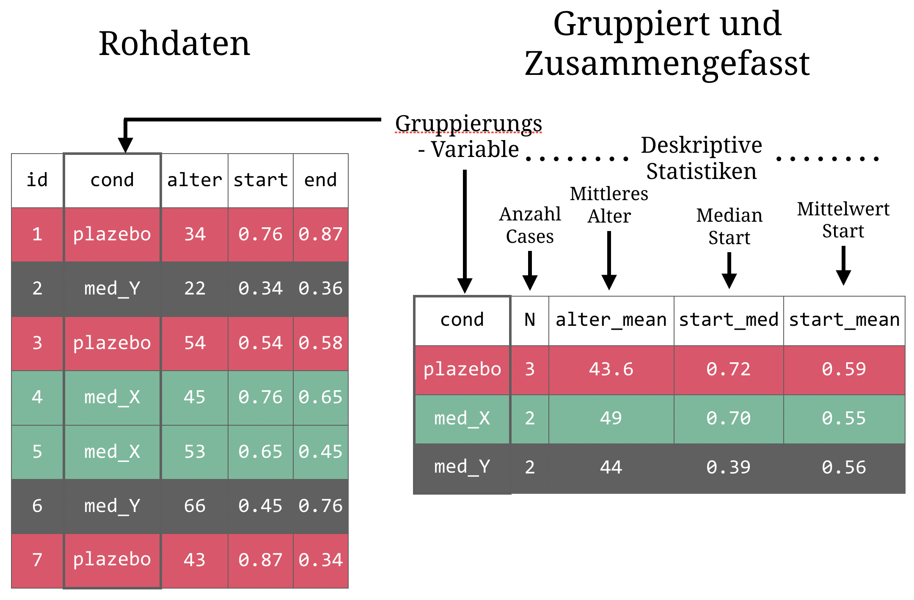

layout: true

<div class="my-footer">
  <span style="text-align:center">
    <span> 
      
    </span>
    <a href="https://therbootcamp.github.io/">
      <span style="padding-left:82px"> 
        <font color="#7E7E7E">
          www.therbootcamp.com
        </font>
      </span>
    </a>
    <a href="https://therbootcamp.github.io/">
      <font color="#7E7E7E">
       Explorative Datenanalyse mit R @ CSS | Dezember 2019
      </font>
    </a>
    </span>
  </div> 

---
  
```{r, eval = FALSE, echo = FALSE, message=FALSE}
# Code to knit slides
xaringan::inf_mr('_sessions/D1S2_Wrangling/Wrangling.Rmd')

```

```{r setup, include=FALSE}
options(htmltools.dir.version = FALSE)
options(width=110)
options(digits = 4)
library(tidyverse)
basel <- read_csv("../../1_Data/basel.csv")
studie <- tibble(id = c(1, 2),
                 medikament = c("medikament", "plazebo"),
                 baseline = c(3, 4),
                 t1 = c(8, 6))

patienten <- tibble(id = c(1, 2, 3, 4, 5),
                    X1 = c(37, 65, 57, 34, 45),
                    X2 = c(1, 2, 2, 1, 2))

ergebnisse <- tibble(id = c(4, 92, 1, 2, 99),
                     t_1 = c(100, 134, 123, 143, 102),
                     t_2 = c(105, 150, 135, 140,68))
patienten_ergebnisse = patienten %>% 
  rename(alter = X1, bedingung = X2) %>%
  mutate(bed_label = case_when(
    bedingung == 1 ~ "placebo",
    bedingung == 2 ~ "medikament")) %>%
  # Verbinde mit ergebnisse
  left_join(ergebnisse, by = "id")


```

# Inhalte

.pull-left45[

<font size = 5><high>Organisation, Transformation und Variablenauswahl</high></font>

- Bsp: Alle Variablen, die mit "xyz_" anfangen

<font size = 5><high>Datenformat transformieren</high></font>

- Bsp: Wide &#8594; Long Format

<font size = 5><high>Gruppen erstellen</high></font>

- Bsp: Nach Geschlecht und Bildung gruppieren

<font size = 5><high>Deskriptive Statistiken erstellen</high></font>

- Bsp: Berechnen des mittleren Alters (`mean(alter)`)

]


.pull-right45[

<br>

<p align="center">
<br>
<font style="font-size:10px">from <a href="https://www.codeastar.com/data-wrangling/">codeastar</a></font></p>

]

---

# Organisation, Transformation und Variablenauswahl

.pull-left4[

Organisation:

- `drop_na()`
- `replace_na()`
- `pull()`

Transformation:

- `mutate_if()`

Variablenauswahl

- `starts_with()`
- `contains()`
- `:`


]

.pull-right55[

```{r}
patienten_ergebnisse
```


]

---

# Organisation, Transformation und Variablenauswahl

.pull-left4[

Organisation:

- <high>drop_na()</high>
- <high>replace_na()</high>
- `pull()`

Transformation:

- `mutate_if()`

Variablenauswahl

- `starts_with()`
- `contains()`
- `:`


]

.pull-right55[

```{r}
patienten_ergebnisse %>%
  mutate(t_1 = replace_na(t_1, 110))

patienten_ergebnisse %>%
  drop_na()
```


]

---


# Organisation, Transformation und Variablenauswahl

.pull-left4[

Organisation:

- `drop_na()`
- `replace_na()`
- <high>pull()</high>

Transformation:

- `mutate_if()`

Variablenauswahl

- `starts_with()`
- `contains()`
- `:`


]

.pull-right55[

```{r}
patienten_ergebnisse %>%
  select(alter) %>%
  pull()

patienten_ergebnisse %>%
  select(alter) %>%
   pull() %>%
  class()
```


]


---


# Organisation, Transformation und Variablenauswahl

.pull-left4[

Organisation:

- `drop_na()`
- `replace_na()`
- `pull()`

Transformation:

- <high>mutate_if()</high>

Variablenauswahl

- `starts_with()`
- `contains()`
- `:`


]

.pull-right55[

```{r}
patienten_ergebnisse %>%
  mutate_if(is.character, factor)

```


]

---


# Organisation, Transformation und Variablenauswahl

.pull-left4[

Organisation:

- `drop_na()`
- `replace_na()`
- `pull()`

Transformation:

- `mutate_if()`

Variablenauswahl

- <high>starts_with()</high>
- `contains()`
- `:`


]

.pull-right55[

```{r}
patienten_ergebnisse %>%
  select(starts_with("t"))
```


]

---


# Organisation, Transformation und Variablenauswahl

.pull-left4[

Organisation:

- `drop_na()`
- `replace_na()`
- `pull()`

Transformation:

- `mutate_if()`

Variablenauswahl

- `starts_with()`
- <high>contains()</high>
- `:`


]

.pull-right55[

```{r}
patienten_ergebnisse %>%
  select(contains("_"))
```


]

---


# Organisation, Transformation und Variablenauswahl

.pull-left4[

Organisation:

- `drop_na()`
- `replace_na()`
- `pull()`

Transformation:

- `mutate_if()`

Variablenauswahl

- `starts_with()`
- `contains()`
- <high>:</high>


]

.pull-right55[

```{r}
patienten_ergebnisse %>%
  select(alter:t_1)
```


]

---

# Long und Wide Format

.pull-left4[
<br>
Je nach Funktion werden Daten im Wide-Format (breites oder ungestapeltes Format), oder Daten im Long-Format (langes oder gestapeltes Format) benötigt.

Benutze <high>`pivot_longer()`</high> und <high>`pivot_wider()`</high> aus dem `tidyr` Paket um Daten zu transformieren 

<br>

| Funktion | Resultat |
|:----------|:-------|
|`pivot_longer()`|<high>Wide &#8594; Long</high> Format|
|`pivot_wider()`|<high>Long &#8594; Wide</high> Format|

]

.pull-right55[

<p align="center">
<br>
<font style="font-size:10px">adapted from <a href="https://github.com/gadenbuie/tidyexplain">tidyexplain</a></font></p>

]


---

# `pivot_longer()`

.pull-left45[

<br>

```{r}
# Original Daten (wide)
studie
```

]

.pull-right45[

<br>

```{r eval = FALSE}
# wide zu long
data %>% 
  pivot_longer(cols = Spaltenauswahl,
               names_to = "Gruppe",
               values_to = "Werte")
```

]
---

# `pivot_longer()`

.pull-left45[

<br>

```{r}
# Original Daten (wide)
studie
```

]

.pull-right45[

<br>

```{r}
# wide zu long
studie %>% 
  pivot_longer(cols = c("baseline", "t1"),
               names_to = "zeitpunkt",
               values_to = "rating")

```

]
---


# `pivot_wider()`

.pull-left45[

<br>

```{r echo = FALSE}
studie_long <- studie %>% 
  pivot_longer(cols = c("baseline", "t1"),
               names_to = "zeitpunkt",
               values_to = "rating")

```


```{r}
# Original Daten (long)
studie_long
```

]

.pull-right45[

<br>

```{r eval = FALSE}
# long zu wide
data %>% 
  pivot_wider(names_from = "Gruppe",
               values_from = "Werte")
```

]

---


# `pivot_wider()`

.pull-left45[

<br>

```{r}
# Original Daten (long)
studie_long
```

]

.pull-right45[

<br>

```{r}
# long zu wide
studie_long %>% 
  pivot_wider(names_from = "zeitpunkt",
               values_from = "rating")
```

]

---


# `summarise()`

.pull-left45[


```{r, echo = TRUE, eval = FALSE}
data %>%
  summarise(
    NAME = SUMMARY_FUN(A),
    NAME = SUMMARY_FUN(B)
  )
```


]

.pull-right5[

```{r}
# Berechne deskriptive Statistiken
basel %>%
  summarise(
    N = n(),
    alter_mean = mean(alter),
    groesse_median = median(groesse)
  )
```


]

---


# `summarise_if()`

.pull-left45[


```{r, echo = TRUE, eval = FALSE}
data %>%
  summarise_if(
    classification,
    SUMMARY_FUN,
    Arguments
  )
```


]

.pull-right5[

```{r}
# Berechne deskriptive Statistiken
basel %>%
  select(1:5) %>%
  summarise_if(
    is.numeric,
    mean,
    na.rm = TRUE
  )
```


]

---

# Gruppierte Aggregation

<p align="center">
  
</p> 


---

# `group_by()`, `summarise()`

.pull-left45[

Benutze `group_by()` zum <high>gruppieren</high> von Daten über eine oder mehrere Variablen

Nach dem Gruppieren, benutze `summarise()` zur <high>Berechnung deskriptiver Statistiken</high> über Gruppen von Daten

]

.pull-right5[

```{r}
# Gruppiere über Variable geschlecht
# Berechne deskriptive Statistiken
basel %>%
  group_by(geschlecht) %>%
  summarise(
    N = n(),
    alter_mean = mean(alter),
    groesse_median = median(groesse)
  )
```

]

---

# Auswahlfunktionen

.pull-left35[

- <high>n()</high>
- <high>first()</high>
- <high>last()</high>
- <high>nth()</high>

]

.pull-right65[

```{r}
# Gruppiere über Variable geschlecht
# Berechne deskriptive Statistiken
basel %>%
  group_by(geschlecht) %>%
  arrange(desc(einkommen)) %>%
  summarise(
    N = n(),
    bildung_first = first(bildung),
    bildung_last = last(bildung),
    bildung_150 = nth(bildung, 150)
  )
```

]

---

# Kombiniere Funktionen

.pull-left4[
<br><br>
Wrangling Funktionen (z.B. `filter()`, `slice()`, `rename()`) mit Gruppierung und Berechnung deskriptiver Statistiken verbinden. 

Benutze dafür die Pipe <high>%>%</high>


]

.pull-right55[

```{r}
basel %>%
  filter(geschlecht == "m" & kinder > 0) %>% 
  mutate(groesse_m = groesse / 100,
         bmi = gewicht / groesse_m ^2) %>%
  group_by(bildung) %>%
  summarise(
    N = n(),
    bmi_mean = mean(bmi, na.rm = TRUE),
    bmi_max = max(bmi, na.rm = TRUE),
    bmi_min = min(bmi, na.rm = TRUE)
  )
```

]

---


class: middle, center

<h1><a href="https://therbootcamp.github.io/DMR_2019CSS/_sessions/WranglingII/WranglingII_practical.html">Practical</a></h1>
